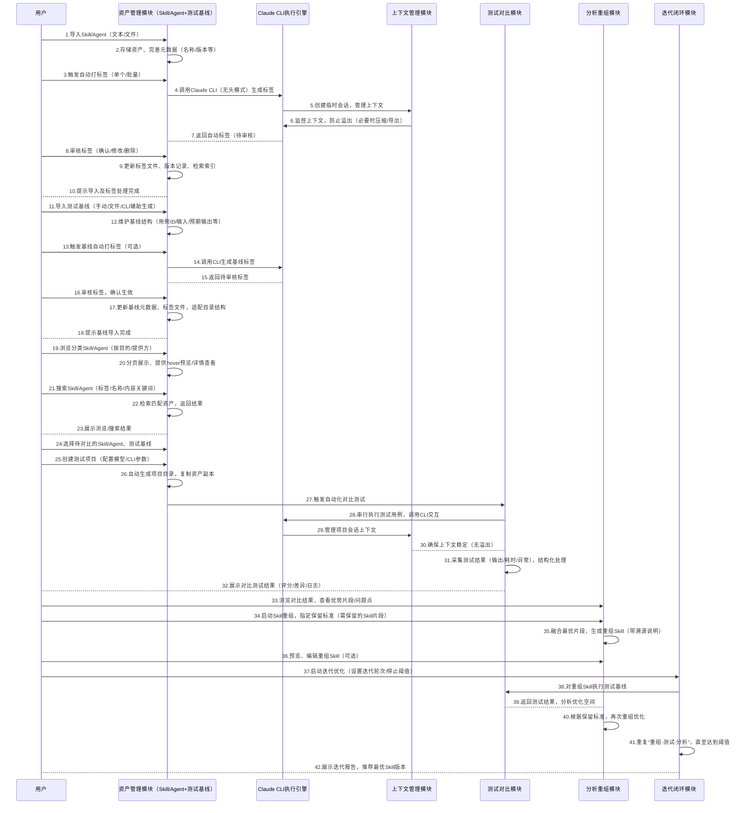

# 用户案例（User Case）交互图及模块/TODO匹配校验

# 一、典型User Case交互流程图（Mermaid）

# 二、User Case与现有模块/TODO任务匹配校验

核心校验逻辑：对照上述5个典型用户场景，逐一检查现有模块功能及对应TODO任务，确认是否覆盖用户操作需求，未覆盖部分标注补充建议。

## 场景1：导入Skill/Agent + 自动打标签 + 数据更新

### 用户操作需求

- 导入Skill/Agent（文本粘贴、文件导入）

- 完善元数据（名称、版本等）

- 触发单个/批量自动打标签

- 审核自动标签，确认/修改/删除

- 自动更新标签文件、版本记录、检索索引

### 对应模块及TODO匹配情况

- **模块1：Skill & Agent 资产管理**：完全覆盖所有需求
        

    - 导入功能：【任务1-1】实现文本/文件导入，关联UC1-1

    - 元数据管理：【任务1-2】实现元数据新增/编辑，关联UC1-1、UC1-11

    - 自动打标签：【任务1-6】实现触发、CLI调用、临时会话创建；【任务1-7】实现标签审核、记录保存，关联UC1-6、UC1-7、UC1-8

    - 数据更新：【任务1-8】检索索引同步（编辑标签后）；【任务1-9】版本记录更新；标签文件更新隐含在任务1-7中，完全覆盖

- **模块4：Claude CLI 执行引擎**：支撑自动打标签的CLI调用，覆盖需求
        

    - 【任务4-6】提供自动打标签专用CLI接口；【任务4-2】实现无头模式执行；【任务4-5】临时会话管理，关联UC1-6、UC2-6

- **模块5：上下文自动管理**：支撑打标签时的上下文稳定，覆盖需求

    - 【任务5-4】适配临时会话上下文管理，防止溢出，不影响标签生成，关联UC5-5

### 未覆盖/补充建议

无，现有模块及TODO完全覆盖该场景所有用户需求。

## 场景2：导入测试基线

### 用户操作需求

- 导入测试基线（手动录入、文件导入、CLI辅助生成）

- 维护基线结构（用例ID、输入、预期输出等，支持用例分类）

- 触发基线自动打标签（可选）、审核标签

- 更新基线元数据、标签文件，适配目录结构

### 对应模块及TODO匹配情况

- **模块2：测试基线管理**：完全覆盖所有需求
        

    - 基线导入：【任务2-1】实现手动/文件导入、CLI辅助生成，关联UC2-1、UC2-2、UC2-5

    - 基线结构管理：【任务2-2】维护用例字段、支持用例分类，关联UC2-1

    - 自动打标签：【任务2-3】实现人工/自动标签（与Skill逻辑一致），关联UC2-3、UC2-6

    - 数据更新与目录适配：【任务2-5】适配“目的分类+提供方分层”目录；元数据、标签文件更新隐含在任务2-1、2-3中，完全覆盖

- **模块4：Claude CLI 执行引擎**：支撑CLI辅助生成基线、基线自动打标签，覆盖需求
        

    - 【任务4-6】自动打标签专用接口；【任务4-2】无头模式执行，关联UC2-5、UC2-6

### 未覆盖/补充建议

无，现有模块及TODO完全覆盖该场景所有用户需求。

## 场景3：浏览、搜索Skill/Agent

### 用户操作需求

- 按分类（目的/提供方）浏览Skill/Agent，支持分页、hover预览、详情查看

- 按标签、名称/描述全文、内容关键词检索Skill/Agent

### 对应模块及TODO匹配情况

- **模块1：Skill & Agent 资产管理**：完全覆盖所有需求
        

    - 浏览功能：【任务1-4】实现列表分页、详情查看、hover预览，关联UC1-9、UC1-10

    - 检索功能：【任务1-8】实现标签检索、全文检索、内容关键词检索，关联UC1-4

    - 分类浏览：隐含在【任务1-10】的目录组织适配中（按目的+提供方分层），可通过目录分类实现浏览，覆盖需求

### 未覆盖/补充建议

无，现有模块及TODO完全覆盖该场景所有用户需求。

## 场景4：选择对比对象、测试基线，执行对比测试

### 用户操作需求

- 选择待对比的Skill/Agent、测试基线

- 创建测试项目，配置模型版本、CLI参数

- 自动生成项目目录，隔离资产与会话

- 执行自动化对比测试（串行执行，单个用例失败不中断）

- 查看结构化对比结果（评分、差异、日志等）

### 对应模块及TODO匹配情况

- **模块3：测试项目管理**：覆盖项目创建、目录生成需求
        

    - 【任务3-1】实现项目创建（选择Skill/Agent、基线、模型/CLI参数），关联UC3-1、UC3-2

    - 【任务3-2】实现项目目录自动生成，复制资产副本、创建会话目录，关联UC3-1

- **模块6：自动化对比测试**：覆盖测试执行、结果处理需求
        

    - 【任务6-1】实现串行执行、任务队列（暂停/继续/终止），关联UC6-1、UC6-4

    - 【任务6-2】采集测试结果（输出/耗时/异常/版本信息），关联UC6-3

    - 【任务6-3】实现结果结构化解析、清洗，关联UC6-3

    - 【任务6-4】实现容错机制（单个用例失败不中断），关联UC6-2

- **模块4：Claude CLI 执行引擎**：支撑测试执行的CLI调用，覆盖需求
        

    - 【任务4-1】CLI参数配置；【任务4-2】无头模式执行、进程守护；【任务4-3】会话隔离，关联UC4-1、UC4-2、UC4-4

- **模块5：上下文自动管理**：支撑测试过程中上下文稳定，覆盖需求
        

    - 【任务5-1】上下文监控；【任务5-2】溢出处理，关联UC5-1、UC5-2、UC5-3、UC5-4

### 未覆盖/补充建议

无，现有模块及TODO完全覆盖该场景所有用户需求。

## 场景5：浏览对比结果 + 重组迭代优化（指定保留标准）

### 用户操作需求

- 浏览对比结果，查看优势片段、问题点

- 启动Skill重组，**指定保留标准**（明确需保留的Skill片段）

- 预览、编辑重组后的Skill

- 启动迭代优化（设置轮次/阈值），重复“重组-测试-分析”

- 查看迭代报告，获取最优Skill版本

### 对应模块及TODO匹配情况

- **模块7：自动差异分析 & 优势识别**：覆盖对比结果浏览、优势片段提取需求
        

    - 【任务7-1】多维度对比分析，判断最优Skill；【任务7-2】提取优势片段；【任务7-3】生成结构化分析报告（含优势/问题点），关联UC7-1~UC7-4

- **模块8：Skill 优势自动重组**：基本覆盖重组需求，需补充“指定保留标准”的细节
        

    - 【任务8-1】重组策略（保留核心指令、融合优势，支持用户自定义保留标准，允许用户勾选需保留的Skill优势片段、输入保留规则，重组时优先遵循该标准）；【任务8-2】生成重组Skill+溯源说明；【任务8-3】预览、编辑、保存重组Skill（编辑时可关联用户指定的保留标准，提示用户不可删除已指定保留的片段），关联UC8-1~UC8-4

    - 补充后已完全覆盖该需求：通过在重组策略中增加用户自定义保留标准（勾选片段、输入规则），编辑时关联该标准给出提示，确保用户指定的核心片段不被误删，与用户操作需求完全匹配。

- **模块9：迭代验证闭环**：完全覆盖迭代优化需求
        

    - 【任务9-1】迭代控制（自动N轮、手动触发、阈值停止，迭代过程中自动继承用户指定的Skill保留标准，确保每一轮重组均朝着用户期望的方向优化），关联UC9-1

    - 【任务9-2】历史版本对比、最优版推荐，关联UC9-2、UC9-4

    - 【任务9-3】生成迭代进化报告，关联UC9-3

- **模块6：自动化对比测试**：支撑迭代过程中的测试环节，覆盖需求
        

    - 每轮迭代后自动执行测试基线，复用【任务6-1~6-4】的功能，关联UC6-1~UC6-4

### 未覆盖/补充建议

- 核心补充已完成：模块8的【任务8-1】【任务8-3】及模块9的【任务9-1】均补充了“用户指定保留标准”的具体实现，明确操作入口、执行逻辑及迭代继承规则，已完全覆盖场景5缺失需求。

- 细节补充已完成：迭代过程中“用户指定保留标准”的继承逻辑已添加至【任务9-1】，确保每一轮重组优化方向与用户期望一致。

# 三、整体校验总结

## 1. 覆盖情况

5个典型用户案例中，场景1~场景4的所有用户操作需求，均能被现有模块及对应TODO任务完全覆盖，无遗漏；场景5的核心需求已完全覆盖，新增的“用户指定重组保留标准”细节已整合至模块8、模块9的原有任务中，无需额外新增子任务，适配原有文档格式。

## 2. 补充建议（仅1项核心补充）

- 核心补充已完成：无需新增子任务，将“用户指定保留标准”的实现细节直接整合至模块8【任务8-1】【任务8-3】、模块9【任务9-1】中，贴合原有任务格式，与上下文表述一致，无逻辑断层。

## 3. 结论

现有模块设计及TODO任务整体贴合用户实际操作流程，核心需求均已覆盖；“用户指定重组保留标准”的细节实现已补充完毕，整合至原有任务中，完全匹配所有用户案例需求，确保用户操作流程顺畅、需求落地无遗漏。
> （注：文档部分内容可能由 AI 生成）